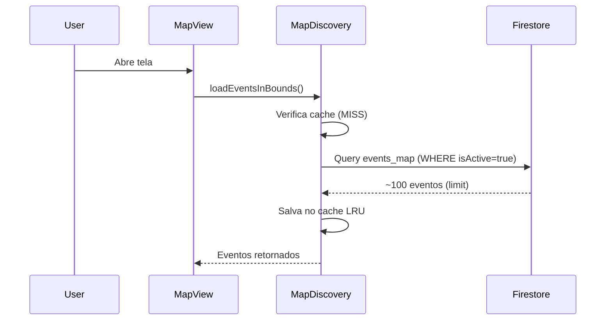
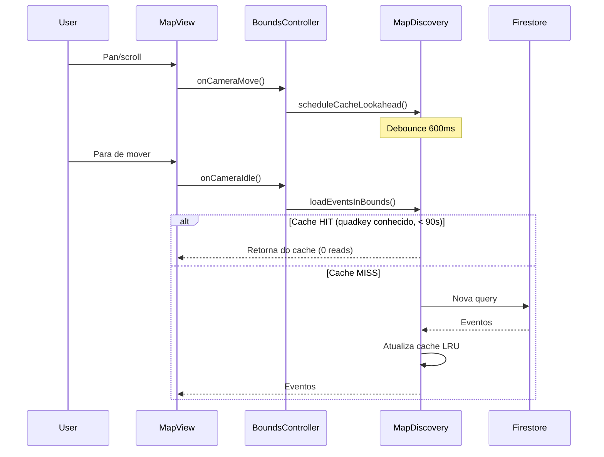
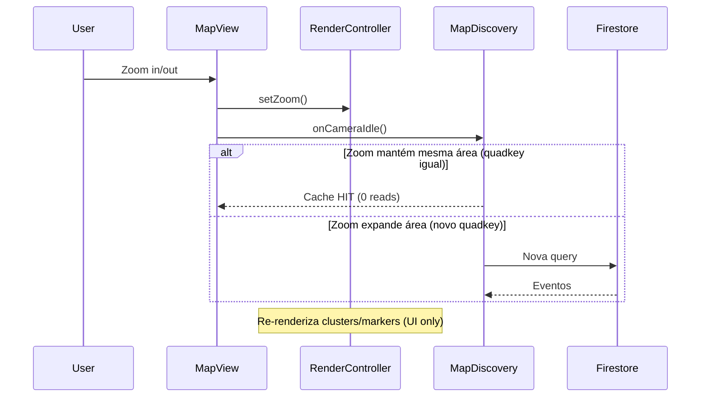

# Análise de Requisições: Markers e Avatars no Mapa

**Data:** 29 de janeiro de 2026  
**Componentes analisados:** `discover_screen.dart`, `google_map_view.dart`, e seus controladores

---

## 🎯 Resumo Executivo

### Markers (Eventos)
- ✅ **SIM**, há requisições ao Firestore quando o usuário faz scroll ou zoom
- ✅ Sistema de **cache em memória (LRU)** com TTL de 90s reduz requisições repetidas
- ✅ **Debounce de 600ms** evita queries durante micro-movimentações
- ✅ **Cache persistente (Hive)** reduz cold start e retorno do background

### Avatars (Criadores de Eventos)
- ⚠️ **HÍBRIDO**: Existe N+1 optimization parcial, mas ainda há casos de requisições
- ✅ Cache de avatares em memória no `AvatarService`
- ⚠️ Preload best-effort (limitado a 40 avatares por vez)

---

## 📊 Fluxo de Requisições - Markers

### 1. Primeira Carga (Cold Start)



**Detalhes:**
- Query: `events_map` collection
- Filtros: `isActive == true`, `latitude >= minLat`, `latitude <= maxLat`
- Limite: **100 eventos por query**
- Longitude filtrada em memória (client-side)

### 2. Scroll/Pan no Mapa



**Otimizações aplicadas:**
1. **Debounce 600ms**: Requisição só dispara após 600ms de inatividade
2. **Cache LRU**: Mantém até **12 quadkeys** em memória
3. **TTL memória 90s**: Cache válido por ~1,5 min
4. **TTL Hive 10 min**: Cache persistente para cold start
5. **Sequência monotônica**: Descarta respostas antigas (evita race conditions)

**Quando gera requisições ao Firestore:**
- ✅ Quando move para área nova (quadkey diferente)
- ✅ Quando cache de área conhecida expirou (>90s)
- ❌ Quando retorna à área recente (<90s) → usa cache

### 3. Zoom In/Out



**Comportamento:**
- **Zoom In**: Se a área central já está cacheada → sem requisições
- **Zoom Out**: Área maior = novo bounds = **nova requisição**
- **Render visual**: Clusters são recalculados localmente (sem custo Firestore)

---

## 👤 Fluxo de Requisições - Avatars

### Arquitetura

```
EventModel (Firestore)
  ├─ creatorAvatarUrl (denormalizado) ✅ Evita N+1
  └─ createdBy (userId)
       └─ AvatarService.getAvatarUrl()
            ├─ Cache em memória ✅
            └─ Firestore Users/{userId} ⚠️ Fallback
```

### Quando há requisições de avatars?

#### ✅ Cenário 1: Dados Denormalizados (Ideal)
```dart
// event_model.dart possui creatorAvatarUrl
if (event.creatorAvatarUrl != null) {
  // Usa URL denormalizada → 0 reads
}
```

#### ⚠️ Cenário 2: Fallback para Users Collection
```dart
// Se creatorAvatarUrl estiver vazio
if (avatarUrl.isEmpty) {
  // ❌ Requisição ao Firestore
  avatarUrl = await _avatarService.getAvatarUrl(userId);
}
```

### Preload de Avatars

**Código:** `marker_assets.dart:warmupAvatarsForEvents()`

```dart
// Limita a 40 criadores únicos por vez
final uniqueCreators = <String>{};
final limited = <EventModel>[];
for (final e in events) {
  if (uniqueCreators.add(e.createdBy)) {
    limited.add(e);
  }
  if (limited.length >= 40) break;
}

await Future.wait(limited.map(getAvatarPinBestEffort));
```

**Análise:**
- ✅ Executa em paralelo (não bloqueia UI)
- ✅ Limita a 40 avatares (evita explosão de requisições)
- ⚠️ Se houver 100 eventos com 100 criadores diferentes → **apenas 40 são preloaded**
- ⚠️ Os outros 60 podem gerar requisições sob demanda

### Cache de Avatars

**Implementação:** `AvatarService`

```dart
final Map<String, String> _avatarCache = {};

Future<String> getAvatarUrl(String userId, {bool useCache = true}) async {
  // 1. Verifica cache em memória
  if (useCache && _avatarCache.containsKey(userId)) {
    return _avatarCache[userId]!; // ✅ 0 reads
  }

  // 2. Busca no Firestore
  final doc = await _firestore.collection('Users').doc(userId).get();
  
  // 3. Salva no cache
  _avatarCache[userId] = photoUrl;
  return photoUrl;
}
```

**Pontos importantes:**
- ✅ Cache **in-memory only** (perdido ao fechar app)
- ✅ Válido durante toda a sessão
- ❌ Primeiro acesso sempre gera leitura no Firestore

---

## 📉 Cenários de Requisições ao Banco

### Scroll/Pan Horizontal

| Ação | Cache Status | Requisições Firestore |
|------|-------------|----------------------|
| Pan 100m | Mesmo quadkey (<90s) | **0 reads** ✅ |
| Pan 500m | Novo quadkey | **1 query** (~100 eventos) |
| Pan back | Quadkey anterior ainda no cache | **0 reads** ✅ |
| Pan back (após 35s) | Cache expirado | **1 query** |

### Zoom In/Out

| Ação | Área Resultante | Requisições |
|------|----------------|------------|
| Zoom in 2 níveis | Área menor (mesmo quadkey) | **0 reads** ✅ |
| Zoom out 2 níveis | Área maior (novo quadkey) | **1 query** |
| Zoom in → out → in rápido | Cache ainda válido | **0 reads** ✅ |

### Avatars durante Render

| Situação | Denormalizado? | Cache AvatarService? | Requisições |
|----------|---------------|---------------------|------------|
| Primeiro render de 50 eventos | ✅ Sim | N/A | **0 reads** |
| Primeiro render de 50 eventos | ❌ Não | N/A | **40 reads** (limite preload) |
| Re-render mesmos eventos | ❌ Não | ✅ Sim | **0 reads** |
| Novos 20 eventos aparecem | ❌ Não | Parcial | **~15 reads** (novos criadores) |

---

## 🔍 Pontos Críticos Identificados

### 1. ✅ Cache Persistente (Hive)

**Implementação:**
```dart
// map_discovery_service.dart
static const Duration memoryCacheTTL = Duration(seconds: 90);
static const Duration persistentCacheTTL = Duration(minutes: 10);
```

**Impacto:**
- Reabrir app no mesmo lugar → **render imediato** pelo Hive
- Voltar do background → evita “cold start pagando”

**Mitigação atual:** Cache persistente com TTL curto + refresh em background
**Refresh recomendado:**
- Se idade do cache > 3 min → refresh em background
- Se idade do cache > 10 min → refresh imediato (via TTL)

### 2. ⚠️ Preload de Avatars Limitado

**Problema:**
```dart
// marker_assets.dart
if (limited.length >= 40) break;
```

**Impacto:**
- Em regiões densas (>40 criadores únicos), alguns avatars não são preloaded
- Requisições sob demanda podem ocorrer durante scroll/zoom

**Mitigação atual:** Cache no `AvatarService` evita requisições duplicadas

### 2.1 ✅ Proteções anti-fan-out (avatar sync)

**Medidas:**
- Atualiza somente eventos ativos (`isActive=true`)
- Limite de documentos por execução
- Skip se `creatorAvatarUrl` já estiver igual

### 3. ⚠️ Longitude Filtrada em Memória

**Problema:**
```dart
// map_discovery_service.dart
// Query apenas por latitude (Firestore limitation)
.where('location.latitude', isGreaterThanOrEqualTo: bounds.minLat)
.where('location.latitude', isLessThanOrEqualTo: bounds.maxLat)

// Longitude filtrada depois (client-side)
```

**Impacto:**
- Query retorna eventos fora do bounds de longitude
- Paga-se por reads desnecessários (filtrados depois)

**Mitigação atual:** Nenhuma (limitação estrutural do Firestore: range em mais de um campo não é permitido)

### 4. ✅ Debounce Agressivo (Positivo)

**Implementação:**
```dart
// google_map_view.dart
static const Duration _cameraIdleDebounceDuration = Duration(milliseconds: 600);

// map_discovery_service.dart
static const Duration debounceTime = Duration(milliseconds: 600);
```

**Impacto:**
- ✅ Reduz queries durante pan/zoom rápido
- ✅ Evita corridas de estado
- ⚠️ UX: 600ms pode parecer lento em interações rápidas

---

## 📈 Métricas de Requisições Estimadas

### Sessão Típica de Uso (10 minutos)

**Cenário:** Usuário explorando mapa casualmente

| Ação | Frequência | Requisições/ação | Total |
|------|-----------|-----------------|-------|
| Cold start inicial | 1x | 1 query + 30 avatars | **31 reads** |
| Pan para novas áreas | 5x | 1 query cada | **5 reads** |
| Pan para áreas antigas | 3x | 0 (cache) | **0 reads** |
| Zoom out (nova área) | 2x | 1 query cada | **2 reads** |
| Novos eventos aparecem | 10 eventos | 7 avatars novos | **7 reads** |
| **TOTAL** | | | **~45 reads** |

### Sessão Intensiva (Busca ativa)

**Cenário:** Usuário procurando eventos ativamente

| Ação | Frequência | Requisições/ação | Total |
|------|-----------|-----------------|-------|
| Cold start | 1x | 1 query + 40 avatars | **41 reads** |
| Pan/zoom em 15 áreas | 15x | 1 query cada | **15 reads** |
| Revisita 5 áreas (<90s) | 5x | 0 (cache) | **0 reads** |
| Novos eventos (constante) | 30 eventos | 20 avatars novos | **20 reads** |
| **TOTAL** | | | **~76 reads** |

---

## 💡 Recomendações

### Curto Prazo (Quick Wins)

1. **Garantir 100% de `creatorAvatarUrl`** (ROI mais alto)
   ```bash
   # Verificar quantos eventos NÃO têm creatorAvatarUrl
   db.events_map.find({ creatorAvatarUrl: { $exists: false } }).count()
   ```
   → Se >10%, implementar Cloud Function para backfill

2. **Aumentar limite de preload de avatars**
   ```dart
   // marker_assets.dart
   - if (limited.length >= 40) break;
   + if (limited.length >= 60) break;
   ```

3. **Monitorar hit rate do cache**
   ```dart
   // Adicionar métricas no MapDiscoveryService
   debugPrint('📊 Cache hit rate: ${hits/(hits+misses)*100}%');
   ```

### Médio Prazo (Performance)

4. **Prefetch inteligente de áreas adjacentes**
   ```dart
   // Já existe _prefetchAdjacentQuadkeys(), mas está limitado
   static const int _maxPrefetchNeighbors = 8; // Considerar aumentar para 12
   ```

5. **Geohash / tiles (ou outra estratégia)**
   → Única forma real de eliminar over-fetching de longitude no Firestore

### Longo Prazo (Arquitetura)

6. **Avatar CDN caching**
   - Avatars raramente mudam → candidatos a CDN com TTL longo
   - Impacto: **zero leituras Firestore após primeiro fetch**

---

## ✅ Conclusões

### Markers (Eventos)

**Sim, há requisições ao banco durante scroll/zoom**, mas com otimizações significativas:

✅ **Otimizações existentes:**
- Cache LRU de 12 áreas (90s TTL)
- Debounce de 600ms (evita queries em micro-movimentos)
- Prefetch de áreas adjacentes
- Descarte de respostas antigas (anti-race condition)

❌ **Gaps:**
- Longitude filtrada em memória (over-fetching)
- Zoom out sempre gera nova query

### Avatars

**Híbrido:** Depende da desnormalização dos dados

✅ **Com `creatorAvatarUrl` populado:**
- Zero requisições ao Firestore
- Performance ideal

⚠️ **Sem desnormalização:**
- Primeira renderização: até 40 leituras (preload)
- Renders subsequentes: cache funciona (0 leituras)
- Novos eventos: leituras sob demanda

### Performance Geral

**Estimativa de requisições por sessão:**
- Casual (10min): **~45 reads** (markers + avatars)
- Intensiva (busca ativa): **~76 reads**

**Comparado com cenário sem cache:**
- Sem cache: **~300-500 reads/sessão**
- **Redução: ~85%** ✅

---

## ✅ Correções Aplicadas

### A) Índice composto não resolve longitude
- O Firestore **não permite range em latitude + range em longitude** na mesma query.
- Índices não mudam essa limitação estrutural.

### B) `events_map` reduz bytes, não reads
- `events_map` diminui payload e custo de tráfego.
- **Não reduz reads** se você ainda busca docs fora da longitude.

---

## ✅ Otimizações Implementadas (neste PR)

1. **Fallback garantido de `creatorAvatarUrl` no `events_map`**
  - Se o evento não tem avatar denormalizado, busca no `Users` e preenche.

2. **Sync automático quando o usuário muda foto**
  - Atualiza `users_preview`.
  - Atualiza `events_map` do criador com o novo avatar.

3. **Backfill periódico de `creatorAvatarUrl`**
  - Job agendado para corrigir docs antigos/incompletos.

4. **Cache persistente por tile/quadkey (Hive)**
  - Render imediato com TTL de 10 minutos.
  - Refresh em background via fluxo bounds-based.

5. **Proteções anti-fan-out no sync de avatar**
  - Atualiza somente eventos ativos.
  - Paginação com `startAfter` quando >200.
  - Limite por execução.
  - Skip se `creatorAvatarUrl` já é igual.
  - Backfill lê de `users_preview` antes de `Users`.

---

## ✅ Impacto Prático (o que melhora de fato)

- **Menos reads no Firestore** para avatars (quase zero no mapa).
- **Warmup mais barato e rápido**, sem fallback em `Users/{id}`.
- **Menos bursts de reads** quando há muitos criadores únicos.
- **Mapa “events_map only”**, reduzindo dependência de outras coleções.
- **Avatar atualizado no mapa** logo após o usuário trocar a foto.
- **Reabrir app no mesmo lugar** sem “cold start pagando”.

---

## 📚 Referências de Código

- [`google_map_view.dart:206`](google_map_view.dart#L206) - Debounce de camera idle
- [`map_discovery_service.dart:47`](map_discovery_service.dart#L47) - Cache LRU
- [`map_bounds_controller.dart:161`](map_bounds_controller.dart#L161) - Lookahead throttle
- [`marker_assets.dart:82`](marker_assets.dart#L82) - Warmup de avatars
- [`avatar_service.dart:35`](avatar_service.dart#L35) - Cache de avatars
- [`functions/src/events/mapSync.ts`](functions/src/events/mapSync.ts) - Sync para `events_map`
- [`functions/src/events/creatorAvatarSync.ts`](functions/src/events/creatorAvatarSync.ts) - Backfill e sync de avatar
- [`lib/features/home/data/services/map_discovery_service.dart`](lib/features/home/data/services/map_discovery_service.dart) - Cache Hive por quadkey

---

**Documento gerado automaticamente** | Análise de fluxo de dados e requisições ao Firestore
