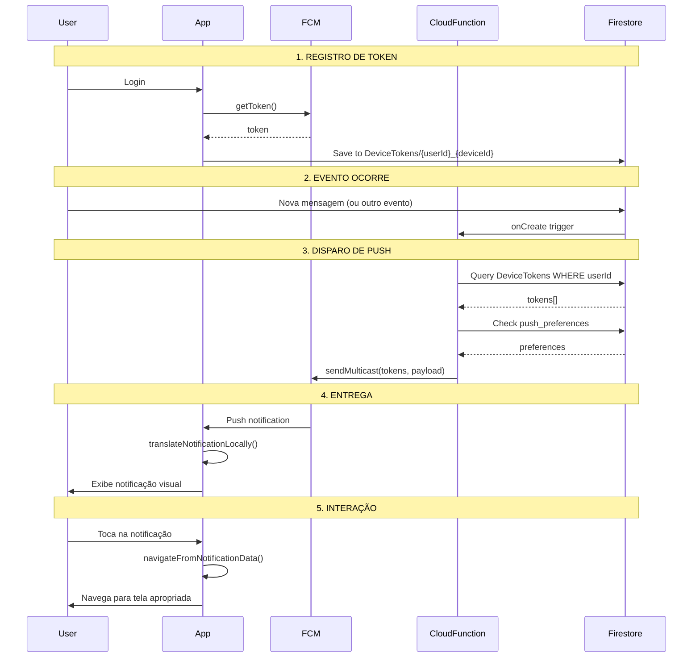

# 📱 SISTEMA DE NOTIFICAÇÕES PUSH - RELATÓRIO COMPLETO

> **Data:** 14 de dezembro de 2025  
> **Projeto:** Partiu  
> **Versão:** 2.0 (Arquitetura Moderna)

---

## 📋 Índice

1. [Visão Geral](#-visão-geral)
2. [Arquitetura do Sistema](#-arquitetura-do-sistema)
3. [Fluxo Completo](#-fluxo-completo)
4. [Componentes Principais](#-componentes-principais)
5. [Gerenciamento de Tokens FCM](#-gerenciamento-de-tokens-fcm)
6. [Push Notifications (Client-Side)](#-push-notifications-client-side)
7. [Cloud Functions (Backend)](#-cloud-functions-backend)
8. [Tipos de Notificações](#-tipos-de-notificações)
9. [Navegação e Deep Links](#-navegação-e-deep-links)
10. [Configurações de Plataforma](#-configurações-de-plataforma)
11. [Preferências do Usuário](#-preferências-do-usuário)
12. [Debugging e Logs](#-debugging-e-logs)
13. [Diagrama de Fluxo](#-diagrama-de-fluxo)

---

## 🎯 Visão Geral

O sistema de notificações push do Partiu é uma arquitetura moderna e escalável que combina:

- **Firebase Cloud Messaging (FCM)** - Infraestrutura de push
- **Flutter Local Notifications** - Exibição de notificações locais
- **Cloud Functions** - Backend serverless para disparo de notificações
- **Firestore** - Armazenamento de notificações in-app e tokens
- **Multi-dispositivo** - Suporte a múltiplos dispositivos por usuário

### Características Principais

✅ **Multi-dispositivo**: Um usuário pode ter tokens em vários devices  
✅ **Notificações Semânticas**: Estrutura tipo/params seguindo best practices  
✅ **Tradução Client-Side**: App traduz notificações baseado no idioma do usuário  
✅ **Preferências Granulares**: Usuário controla tipos de notificação  
✅ **Background/Foreground**: Funciona em todos os estados do app  
✅ **Deep Links**: Navegação contextual ao tocar notificação  
✅ **Notificações Silenciosas**: Flag `n_silent` para updates sem alerta  
✅ **Deduplicação**: Evita notificações duplicadas em conversas abertas  

---

## 🏗️ Arquitetura do Sistema

```
┌─────────────────────────────────────────────────────────────┐
│                    FIREBASE ECOSYSTEM                        │
├─────────────────────────────────────────────────────────────┤
│                                                               │
│  ┌─────────────────┐                                         │
│  │  Cloud          │  1. Trigger (onCreate/onUpdate)         │
│  │  Functions      │ ──────────────────────────┐             │
│  └─────────────────┘                           │             │
│         │                                       ▼             │
│         │                        ┌──────────────────────┐    │
│         │ 2. Query DeviceTokens  │   Firestore DB       │    │
│         │◄───────────────────────│   - DeviceTokens/    │    │
│         │                        │   - Notifications/   │    │
│         │                        │   - Users/           │    │
│         │                        └──────────────────────┘    │
│         │ 3. Check preferences                               │
│         │                                                     │
│         │ 4. Send push via FCM                               │
│         ▼                                                     │
│  ┌─────────────────┐                                         │
│  │  FCM            │                                         │
│  │  (Push Server)  │                                         │
│  └─────────────────┘                                         │
│         │                                                     │
└─────────┼─────────────────────────────────────────────────────┘
          │ 5. Deliver notification
          ▼
┌─────────────────────────────────────────────────────────────┐
│                    FLUTTER APP (CLIENT)                      │
├─────────────────────────────────────────────────────────────┤
│                                                               │
│  ┌─────────────────────────────────────────────────────┐    │
│  │  PushNotificationManager                            │    │
│  │  - Recebe FCM message                               │    │
│  │  - Traduz conteúdo (SharedPreferences locale)      │    │
│  │  - Exibe local notification                         │    │
│  │  - Navega ao tocar                                  │    │
│  └─────────────────────────────────────────────────────┘    │
│                           │                                   │
│                           ▼                                   │
│  ┌─────────────────────────────────────────────────────┐    │
│  │  FlutterLocalNotificationsPlugin                    │    │
│  │  - Exibe notificação visual                         │    │
│  │  - Som/vibração                                     │    │
│  │  - Ícone/badge                                      │    │
│  └─────────────────────────────────────────────────────┘    │
│                                                               │
└───────────────────────────────────────────────────────────────┘
```

---

## 🔄 Fluxo Completo

### 1️⃣ Registro de Token (Login)

```
Usuário faz login
    ↓
AuthSyncService detecta login
    ↓
FcmTokenService.initialize()
    ↓
FirebaseMessaging.getToken()
    ↓
DeviceInfoPlugin.getDeviceId()
    ↓
Salva em DeviceTokens/{userId}_{deviceId}
    {
      userId: "abc123",
      token: "fcm-token-xxx",
      deviceId: "android-device-id",
      platform: "android",
      updatedAt: timestamp
    }
```

### 2️⃣ Disparo de Notificação (Backend)

```
Evento ocorre (nova mensagem, like, etc.)
    ↓
Cloud Function é disparada
    ↓
pushDispatcher.sendPush({
  userId: "receiver-id",
  type: "chat_event",
  title: "Nova mensagem",
  body: "João: Olá!",
  data: { senderId, messagePreview, ... }
})
    ↓
Query DeviceTokens WHERE userId == "receiver-id"
    ↓
Verifica preferências (Users/{userId}.advancedSettings.push_preferences.{type})
    ↓
Se enabled == true:
    ↓
FCM.send(tokens[], payload)
```

### 3️⃣ Recebimento no App

#### **App em FOREGROUND** (aberto)

```
FCM message recebida
    ↓
FirebaseMessaging.onMessage listener
    ↓
PushNotificationManager._setupForegroundHandler()
    ↓
Verifica se está na conversa atual
    (evita notificação duplicada)
    ↓
Se NÃO está na conversa:
    ↓
translateNotificationLocally() - Traduz baseado no idioma
    ↓
FlutterLocalNotificationsPlugin.show()
    (Exibe notificação visual na bandeja)
```

#### **App em BACKGROUND** (minimizado)

```
FCM message recebida
    ↓
firebaseMessagingBackgroundHandler() (top-level function)
    ↓
Inicializa Firebase
    ↓
translateNotificationLocally()
    ↓
PushNotificationManager.showBackgroundNotification()
    ↓
FlutterLocalNotificationsPlugin.show()
```

#### **App TERMINADO** (fechado)

```
FCM entrega notificação via sistema operacional
    ↓
Usuário toca na notificação
    ↓
App inicia
    ↓
PushNotificationManager.handleInitialMessageAfterRunApp()
    ↓
FirebaseMessaging.getInitialMessage()
    ↓
navigateFromNotificationData()
    ↓
Navega para tela apropriada
```

### 4️⃣ Navegação ao Tocar

```
Usuário toca na notificação
    ↓
_onNotificationTapped(payload)
    ↓
Parse JSON payload
    ↓
navigateFromNotificationData(data)
    ↓
Verifica throttling (evita navegações duplicadas)
    ↓
AppNotifications.onNotificationClick()
    ↓
Switch baseado em data['type']:
    - 'message' → ConversationsScreen
    - 'activity_*' → MapNavigationService → EventDetails
    - 'profile_views_aggregated' → ProfileVisitsScreen (VIP check)
    - etc.
```

---

## 🧩 Componentes Principais

### 📱 Client-Side (Flutter)

#### **PushNotificationManager**
`lib/features/notifications/services/push_notification_manager.dart`

**Responsabilidades:**
- Inicializar FCM e local notifications
- Configurar handlers (foreground/background)
- Solicitar permissões (iOS/Android)
- Criar notification channel (Android)
- Traduzir notificações client-side
- Exibir notificações locais
- Navegar ao tocar
- Gerenciar estado (conversa atual, throttling)

**Métodos principais:**
```dart
// Inicialização (chamado no main.dart antes do runApp)
await PushNotificationManager.instance.initialize();

// Após runApp (processa mensagem inicial se app foi aberto via notificação)
await PushNotificationManager.instance.handleInitialMessageAfterRunApp();

// Definir conversa atual (evita notificações duplicadas)
PushNotificationManager.instance.setCurrentConversation(conversationId);

// Limpar conversa atual
PushNotificationManager.instance.clearCurrentConversation();

// Obter token FCM
final token = await PushNotificationManager.instance.getToken();

// Subscribe/Unsubscribe topics
await PushNotificationManager.instance.subscribeToTopic('news');
await PushNotificationManager.instance.unsubscribeFromTopic('news');

// Reset state (logout)
PushNotificationManager.instance.resetState();
```

**Background Handler (top-level):**
```dart
@pragma('vm:entry-point')
Future<void> firebaseMessagingBackgroundHandler(RemoteMessage message) async {
  // DEVE ser top-level function (não pode estar dentro de classe)
  // iOS/Android exigem isso para funcionar em background
}
```

#### **FcmTokenService**
`lib/features/notifications/services/fcm_token_service.dart`

**Responsabilidades:**
- Obter FCM token do dispositivo
- Obter device ID único (Android ID / iOS identifierForVendor)
- Salvar token na coleção `DeviceTokens`
- Configurar listener para token refresh automático
- Limpar tokens ao fazer logout

**Inicialização:**
```dart
// Chamado automaticamente após login no AuthSyncService
await FcmTokenService.instance.initialize();
```

#### **AppNotifications**
`lib/features/notifications/helpers/app_notifications.dart`

**Responsabilidades:**
- Roteamento baseado em tipo de notificação
- Navegação para telas específicas
- Verificação de acesso VIP (quando necessário)
- Integração com MapNavigationService (eventos)

**Switch de tipos:**
```dart
switch (nType) {
  case 'message':
  case 'new_message':
    → Navigate to ConversationsScreen
  
  case 'alert':
    → No action (message already processed)
  
  case 'custom':
    → Handle deepLink or screen parameter
  
  case 'profile_views_aggregated':
    → Check VIP → ProfileVisitsScreen
  
  case 'activity_*':
    → MapNavigationService.navigateToEvent(eventId)
  
  default:
    → Log unknown type
}
```

### ⚙️ Backend (Cloud Functions)

#### **pushDispatcher.ts**
`functions/src/services/pushDispatcher.ts`

**Responsabilidades:**
- Buscar tokens FCM do usuário
- Verificar preferências de notificação
- Enviar push via FCM Admin SDK
- Tratar tokens inválidos
- Logs detalhados

**Função principal:**
```typescript
export async function sendPush({
  userId: string,
  type: PushType, // 'global' | 'chat_event'
  title: string,
  body: string,
  data?: Record<string, string>
}): Promise<void>
```

**Fluxo:**
1. Busca usuário no Firestore (`Users/{userId}`)
2. Verifica preferências: `advancedSettings.push_preferences.{type}`
3. Query: `DeviceTokens WHERE userId == {userId}`
4. Extrai tokens válidos
5. Monta payload FCM
6. Envia via `admin.messaging().sendMulticast()`
7. Limpa tokens inválidos (se houver)

#### **chatPushNotifications.ts**
`functions/src/chatPushNotifications.ts`

**Responsabilidades:**
- Trigger Firestore para mensagens 1-1
- Dispara push para receptor
- **NÃO** cria notificação in-app (apenas push)

**Trigger:**
```typescript
export const onPrivateMessageCreated = functions.firestore
  .document("Messages/{senderId}/{receiverId}/{messageId}")
  .onCreate(async (snap, context) => {
    // Extrai dados da mensagem
    // Chama sendPush() via pushDispatcher
  });
```

#### **eventChatNotifications.ts**
`functions/src/eventChatNotifications.ts`

**Responsabilidades:**
- Trigger Firestore para mensagens de grupo (EventChat)
- Busca participantes do evento
- Dispara push para cada participante (exceto sender)

#### **profileViewNotifications.ts**
`functions/src/profileViewNotifications.ts`

**Responsabilidades:**
- Agregar visualizações de perfil
- Disparar notificações agregadas (ex: "5 pessoas viram seu perfil")
- Suporta notificações VIP

#### **reviewNotifications.ts**
`functions/src/reviews/reviewNotifications.ts`

**Responsabilidades:**
- Notificar sobre avaliações recebidas
- Disparar push para reviewee (pessoa avaliada)

---

## 🔑 Gerenciamento de Tokens FCM

### Coleção: `DeviceTokens`

```
DeviceTokens/
  └── {userId}_{deviceId}
      ├── userId: string              (Index)
      ├── token: string               (FCM token)
      ├── deviceId: string            (Android ID / iOS ID)
      ├── deviceName: string          (ex: "iPhone 13")
      ├── platform: "android" | "ios"
      ├── createdAt: timestamp
      ├── updatedAt: timestamp
      └── lastUsedAt: timestamp
```

### Vantagens do Sistema Multi-dispositivo

✅ **Múltiplos dispositivos**: Usuário recebe push em todos os devices logados  
✅ **Identificação única**: `{userId}_{deviceId}` evita duplicatas  
✅ **Gestão automática**: Tokens expirados são limpos automaticamente  
✅ **Rastreamento**: `lastUsedAt` permite identificar devices inativos  

### Fluxo de Sincronização

```dart
// LOGIN
AuthSyncService detecta login
    ↓
FcmTokenService.initialize()
    ↓
Salva/atualiza token em DeviceTokens

// TOKEN REFRESH (automático)
FirebaseMessaging.onTokenRefresh
    ↓
FcmTokenService listener
    ↓
Atualiza token em DeviceTokens

// LOGOUT
SessionManager.logout()
    ↓
FcmTokenService.clearTokens()
    ↓
Remove token do Firestore
```

### Recuperação Automática

Se `getToken()` retornar `null`:
- Agenda retry em 5 segundos
- Tenta novamente até 3x
- Logs detalhados para debugging

---

## 📱 Push Notifications (Client-Side)

### Handlers de Mensagens

#### **Foreground Handler**
```dart
FirebaseMessaging.onMessage.listen((RemoteMessage message) {
  // App está aberto e visível
  // Verifica se está na conversa atual
  // Traduz conteúdo
  // Exibe notificação local
});
```

#### **Background Handler**
```dart
@pragma('vm:entry-point')
Future<void> firebaseMessagingBackgroundHandler(RemoteMessage message) async {
  // App está minimizado/background
  // DEVE ser top-level function
  // Traduz e exibe notificação
}
```

#### **Initial Message**
```dart
final initialMessage = await FirebaseMessaging.instance.getInitialMessage();
if (initialMessage != null) {
  // App foi aberto pela notificação
  // Navega para tela apropriada
}
```

#### **Message Opened App**
```dart
FirebaseMessaging.onMessageOpenedApp.listen((RemoteMessage message) {
  // Usuário tocou notificação enquanto app estava em background
  // Navega para tela apropriada
});
```

### Tradução Client-Side

**Por que client-side?**
- Backend não conhece idioma do usuário
- Evita duplicar lógica de tradução
- Flexibilidade para A/B tests
- Reduz complexidade do backend

**Fluxo:**
```dart
static Future<Map<String, String>> translateNotificationLocally(
  RemoteMessage message
) async {
  // 1. Ler idioma do SharedPreferences
  final prefs = await SharedPreferences.getInstance();
  final locale = prefs.getString('locale') ?? 'pt';
  
  // 2. Parsear dados da mensagem
  final type = message.data['type'];
  final senderName = message.data['senderName'] ?? 'Alguém';
  
  // 3. Switch baseado em tipo + idioma
  switch (type) {
    case 'message':
      return {
        'title': locale == 'en' ? 'New message' : 'Nova mensagem',
        'body': locale == 'en' 
          ? '$senderName sent you a message'
          : '$senderName enviou uma mensagem',
      };
    // ... outros tipos
  }
}
```

### Notificação Local (Foreground)

```dart
await FlutterLocalNotificationsPlugin().show(
  notification.hashCode, // ID único
  title,
  body,
  NotificationDetails(
    android: AndroidNotificationDetails(
      'partiu_high_importance',
      'Partiu Notifications',
      importance: Importance.max,
      priority: Priority.high,
      playSound: true,
      enableVibration: true,
      enableLights: true,
    ),
    iOS: DarwinNotificationDetails(
      presentAlert: true,
      presentBadge: false,
      presentSound: true,
    ),
  ),
  payload: jsonEncode(payloadData),
);
```

### Payload Structure

```dart
final payloadData = {
  'type': 'message',
  'relatedId': 'conversation-id',
  'senderId': 'user-id',
  'title': 'Nova mensagem',
  'body': 'João: Olá!',
  'message': 'Olá!',
  'deepLink': '',
};
```

---

## ☁️ Cloud Functions (Backend)

### pushDispatcher.ts

**Verificação de Preferências:**
```typescript
const userData = userDoc.data();
const preferences = userData?.advancedSettings?.push_preferences;
const isEnabled = preferences?.[type] ?? true; // Default: true

if (isEnabled === false) {
  console.log('Push bloqueado por preferência do usuário');
  return;
}
```

**Query de Tokens:**
```typescript
const tokensSnapshot = await admin
  .firestore()
  .collection("DeviceTokens")
  .where("userId", "==", userId)
  .get();

const fcmTokens: string[] = [];
tokensSnapshot.docs.forEach((doc) => {
  const token = doc.data().token;
  if (token && token.length > 0) {
    fcmTokens.push(token);
  }
});
```

**Envio via FCM:**
```typescript
const payload = {
  notification: {
    title,
    body,
  },
  data: {
    type,
    click_action: "FLUTTER_NOTIFICATION_CLICK",
    ...customData,
  },
  android: {
    priority: "high",
    notification: {
      sound: "default",
      priority: "high",
    },
  },
  apns: {
    payload: {
      aps: {
        alert: { title, body },
        sound: "default",
        badge: 1,
        "content-available": 1,
      },
    },
  },
};

const response = await admin.messaging().sendMulticast({
  tokens: fcmTokens,
  ...payload,
});
```

**Limpeza de Tokens Inválidos:**
```typescript
response.responses.forEach((resp, idx) => {
  if (!resp.success) {
    const error = resp.error;
    if (
      error?.code === 'messaging/invalid-registration-token' ||
      error?.code === 'messaging/registration-token-not-registered'
    ) {
      // Deletar token inválido do Firestore
      await tokenDocs[idx].ref.delete();
    }
  }
});
```

### Triggers Comuns

#### Chat 1-1
```typescript
functions.firestore
  .document("Messages/{senderId}/{receiverId}/{messageId}")
  .onCreate(async (snap, context) => { ... });
```

#### Chat de Evento (Grupo)
```typescript
functions.firestore
  .document("EventChat/{eventId}/messages/{messageId}")
  .onCreate(async (snap, context) => { ... });
```

#### Avaliações
```typescript
functions.firestore
  .document("Reviews/{reviewId}")
  .onCreate(async (snap, context) => { ... });
```

---

## 📦 Tipos de Notificações

### Client-Side (NotificationEvent)

```dart
enum NotificationEventType {
  message('message'),    // Mensagens de chat
  alert('alert'),        // Alertas do sistema
  custom('custom'),      // Tipos customizados
}
```

### Backend (PushType)

```typescript
type PushType = 
  | "global"      // Notificações globais (rankings, etc)
  | "chat_event"  // Mensagens de chat/evento
```

### Tipos de Atividade

```dart
class ActivityNotificationTypes {
  static const activityCreated = 'activity_created';
  static const activityJoinRequest = 'activity_join_request';
  static const activityJoinApproved = 'activity_join_approved';
  static const activityJoinRejected = 'activity_join_rejected';
  static const activityNewParticipant = 'activity_new_participant';
  static const activityHeatingUp = 'activity_heating_up';
  static const activityExpiringSoon = 'activity_expiring_soon';
  static const activityCanceled = 'activity_canceled';
}
```

### Estrutura Semântica

**Firestore (in-app notification):**
```json
{
  "n_type": "message",
  "n_params": {
    "senderName": "João Silva",
    "messagePreview": "Olá, tudo bem?"
  },
  "n_sender_id": "user-123",
  "n_sender_fullname": "João Silva",
  "n_sender_photo_link": "https://...",
  "n_receiver_id": "user-456",
  "n_related_id": "conversation-id",
  "n_read": false,
  "timestamp": "2025-12-14T10:00:00Z"
}
```

**FCM Push (data payload):**
```json
{
  "type": "message",
  "senderId": "user-123",
  "senderName": "João Silva",
  "senderPhotoUrl": "https://...",
  "relatedId": "conversation-id",
  "messagePreview": "Olá, tudo bem?",
  "messageType": "text",
  "timestamp": "2025-12-14T10:00:00Z"
}
```

---

## 🧭 Navegação e Deep Links

### Roteamento via AppNotifications

```dart
Future<void> onNotificationClick(
  BuildContext context, {
  required String nType,
  required String nSenderId,
  String? nRelatedId,
  String? deepLink,
  String? screen,
}) async {
  switch (nType) {
    case 'message':
      _goToConversationsTab(context);
      break;
    
    case 'activity_created':
    case 'activity_join_request':
      await _handleActivityNotification(context, nRelatedId);
      break;
    
    case 'profile_views_aggregated':
      final hasAccess = await VipAccessService.checkAccessOrShowDialog(context);
      if (hasAccess) context.push(AppRoutes.profileVisits);
      break;
    
    case 'custom':
      if (deepLink != null) _handleDeepLink(context, deepLink);
      else if (screen != null) _handleScreenNavigation(context, screen);
      break;
  }
}
```

### Integração com MapNavigationService

Para notificações de eventos/atividades:

```dart
Future<void> _handleActivityNotification(
  BuildContext context,
  String eventId,
) async {
  // 1. Registrar navegação pendente ANTES de navegar para o mapa
  MapNavigationService.instance.navigateToEvent(eventId);
  
  // 2. Navegar para aba Discover (mapa)
  _goToDiscoverTab(context);
  
  // 3. Quando o mapa carregar, ele automaticamente abrirá o evento
}
```

### Throttling de Navegação

Evita navegações duplicadas:

```dart
bool _shouldNavigate(Map<String, String> data) {
  final key = _computeNavigationKey(data);
  final now = DateTime.now();
  
  // Throttle: 2 segundos
  if (_lastNavigationKey == key && _lastNavigationAt != null) {
    final diff = now.difference(_lastNavigationAt!);
    if (diff < const Duration(seconds: 2)) {
      return false; // Bloqueado
    }
  }
  
  _lastNavigationKey = key;
  _lastNavigationAt = now;
  return true;
}
```

### Deduplicação de Conversas

Evita notificações quando já está na conversa:

```dart
void setCurrentConversation(String? conversationId) {
  _currentConversationId = conversationId ?? '';
}

// No handler foreground:
final conversationId = message.data['conversationId'] ?? 
                      message.data['n_related_id'];

if (conversationId == _currentConversationId && 
    _currentConversationId.isNotEmpty) {
  print('Conversa atual aberta, ignorando notificação');
  return;
}
```

---

## ⚙️ Configurações de Plataforma

### Android

#### **AndroidManifest.xml**
```xml
<manifest>
  <!-- Permissões -->
  <uses-permission android:name="android.permission.POST_NOTIFICATIONS"/>
  <uses-permission android:name="android.permission.VIBRATE"/>
  <uses-permission android:name="android.permission.INTERNET"/>

  <application>
    <!-- FCM Channel padrão -->
    <meta-data
        android:name="com.google.firebase.messaging.default_notification_channel_id"
        android:value="partiu_high_importance" />
    
    <!-- Ícone padrão -->
    <meta-data
        android:name="com.google.firebase.messaging.default_notification_icon"
        android:resource="@mipmap/ic_launcher" />
    
    <!-- Cor padrão -->
    <meta-data
        android:name="com.google.firebase.messaging.default_notification_color"
        android:resource="@color/colorPrimary" />
  </application>
</manifest>
```

#### **Notification Channel**
```dart
const AndroidNotificationChannel channel = AndroidNotificationChannel(
  'partiu_high_importance',
  'Partiu Notifications',
  description: 'This channel is used for important notifications.',
  importance: Importance.max,
  playSound: true,
  enableLights: true,
  enableVibration: true,
);

await FlutterLocalNotificationsPlugin()
  .resolvePlatformSpecificImplementation<AndroidFlutterLocalNotificationsPlugin>()
  ?.createNotificationChannel(channel);
```

### iOS

#### **Info.plist**
```xml
<key>UIBackgroundModes</key>
<array>
    <string>fetch</string>
    <string>remote-notification</string>
</array>
```

#### **Permissões**
```dart
if (Platform.isIOS) {
  final settings = await FirebaseMessaging.instance.requestPermission(
    alert: true,
    badge: false,
    sound: true,
    provisional: false,
  );
  
  if (settings.authorizationStatus == AuthorizationStatus.authorized) {
    print('Permissões concedidas');
  }
}
```

#### **Foreground Presentation**
```dart
await FirebaseMessaging.instance.setForegroundNotificationPresentationOptions(
  alert: true,
  badge: false,
  sound: true,
);
```

### Firebase Setup

#### **google-services.json** (Android)
`android/app/google-services.json`

#### **GoogleService-Info.plist** (iOS)
`ios/Runner/GoogleService-Info.plist`

---

## 🎛️ Preferências do Usuário

### Estrutura no Firestore

```
Users/{userId}/
  └── advancedSettings:
      └── push_preferences:
          ├── global: true/false        // Notificações globais
          └── chat_event: true/false    // Chat e eventos
```

### Backend - Verificação de Preferências

```typescript
const userData = userDoc.data();
const preferences = userData?.advancedSettings?.push_preferences;
const isEnabled = preferences?.[type] ?? true; // Default: enabled

if (isEnabled === false) {
  console.log('🔕 Push bloqueado por preferência do usuário');
  return;
}
```

### Client-Side - UI de Configuração

```dart
// Exemplo de toggle
SwitchListTile(
  title: Text('Notificações de Chat'),
  value: chatEnabled,
  onChanged: (value) async {
    await FirebaseFirestore.instance
      .collection('Users')
      .doc(currentUserId)
      .update({
        'advancedSettings.push_preferences.chat_event': value,
      });
  },
);
```

---

## 🐛 Debugging e Logs

### Logs do PushNotificationManager

```
🔔 Inicializando PushNotificationManager...
📱 Local notifications configuradas
🔐 Permissões iOS: authorized
📢 Android channel criado: partiu_high_importance
[OK] PushNotificationManager inicializado

╔═══════════════════════════════════════
║ 📨 MENSAGEM RECEBIDA (FOREGROUND)
╠═══════════════════════════════════════
║ Message ID: 1234567890
║ Sent Time: 2025-12-14 10:00:00
║ Data: {type: message, senderId: user-123, ...}
╚═══════════════════════════════════════

[OK] Notificação local exibida
```

### Logs do FcmTokenService

```
╔══════════════════════════════════════════════════════════════
║ 🔑 [FCM Token Service] INICIALIZANDO
╠══════════════════════════════════════════════════════════════

👤 [FCM Token] User ID: abc123
📧 [FCM Token] Email: user@example.com

🔍 [FCM Token] Passo 1: Obtendo FCM token...
✅ [FCM Token] Token obtido: 20 chars

🔍 [FCM Token] Passo 2: Obtendo Device ID...
📱 [FCM Token] Device ID: android-device-123

🔍 [FCM Token] Passo 3: Salvando no Firestore...
📝 [FCM Token] Document Path: DeviceTokens/abc123_android-device-123
✅ [FCM Token] Token salvo/atualizado com sucesso

🔍 [FCM Token] Passo 4: Configurando listener de refresh...
✅ [FCM Token] Listener configurado

╠══════════════════════════════════════════════════════════════
║ ✅ [FCM Token Service] INICIALIZAÇÃO COMPLETA
╚══════════════════════════════════════════════════════════════
```

### Logs do pushDispatcher (Cloud Functions)

```
🔥 [PushDispatcher] sendPush CALLED
   - userId: user-456
   - type: chat_event
   - title: Nova mensagem
   - body: João: Olá!

🔍 [PushDispatcher] Buscando tokens para userId: user-456
📍 [PushDispatcher] Collection: DeviceTokens
🔎 [PushDispatcher] Query: where("userId", "==", "user-456")
📊 [PushDispatcher] Tokens encontrados: 2

🚀 [PushDispatcher] Enviando push (chat_event) para 2 dispositivo(s)
✅ [PushDispatcher] Push enviado com sucesso

📊 [PushDispatcher] Resultados:
   - Sucesso: 2
   - Falha: 0
```

### Testando Push Notifications

#### Via Cloud Function HTTP
```bash
curl -X POST https://us-central1-{project-id}.cloudfunctions.net/testPush \
  -H "Content-Type: application/json" \
  -d '{
    "userId": "abc123",
    "title": "Teste",
    "body": "Notificação de teste"
  }'
```

#### Via Firebase Console
1. Ir para **Cloud Messaging** no console Firebase
2. Clicar em **Send your first message**
3. Preencher título/corpo
4. Selecionar dispositivos (token ou topic)
5. **Additional options** → Data payload (JSON)
6. Enviar

#### Debug no App
```dart
// Imprimir token no console
final token = await PushNotificationManager.instance.getToken();
print('🔑 FCM Token: $token');

// Verificar recebimento
FirebaseMessaging.onMessage.listen((message) {
  print('✅ Push recebido: ${message.messageId}');
  print('   Data: ${message.data}');
});
```

---

## 📊 Diagrama de Fluxo



---

## 📈 Estatísticas e Métricas

### Monitoramento Recomendado

1. **Taxa de Entrega**
   - Success rate do FCM
   - Tokens inválidos/expirados

2. **Engagement**
   - Click-through rate (notificações tocadas)
   - Tempo até interação

3. **Performance**
   - Latência (evento → push entregue)
   - Taxa de erro em Cloud Functions

4. **Preferências**
   - % usuários com notificações desabilitadas
   - Tipos mais/menos aceitos

### Firebase Analytics

```dart
// Log quando usuário toca notificação
FirebaseAnalytics.instance.logEvent(
  name: 'notification_opened',
  parameters: {
    'type': notificationType,
    'source': 'push',
  },
);
```

---

## 🔐 Segurança

### Regras do Firestore (DeviceTokens)

```javascript
match /DeviceTokens/{tokenId} {
  // Usuário só pode ler/escrever seus próprios tokens
  allow read, write: if request.auth != null && 
                       resource.data.userId == request.auth.uid;
}
```

### Cloud Functions - Auth Check

```typescript
// Verifica autenticação via Firebase Admin SDK
const userDoc = await admin.firestore()
  .collection('Users')
  .doc(userId)
  .get();

if (!userDoc.exists) {
  console.warn('Usuário não encontrado');
  return;
}
```

---

## ✅ Checklist de Implementação

### Setup Inicial
- [ ] Firebase configurado (google-services.json + GoogleService-Info.plist)
- [ ] Dependências adicionadas (firebase_messaging, flutter_local_notifications)
- [ ] Permissões configuradas (AndroidManifest.xml + Info.plist)
- [ ] Notification channel criado (Android)

### Client-Side
- [ ] PushNotificationManager inicializado no main()
- [ ] Background handler configurado (top-level function)
- [ ] FcmTokenService integrado ao AuthSyncService
- [ ] AppNotifications configurado com rotas
- [ ] Tradução client-side implementada

### Backend
- [ ] Cloud Functions deployadas
- [ ] pushDispatcher implementado
- [ ] Triggers configurados (chat, eventos, etc)
- [ ] Preferências de usuário respeitadas
- [ ] Limpeza de tokens inválidos

### Testes
- [ ] Push em foreground
- [ ] Push em background
- [ ] Push com app fechado
- [ ] Navegação ao tocar
- [ ] Multi-dispositivo
- [ ] Preferências de usuário
- [ ] Notificações silenciosas

---

## 🚀 Melhorias Futuras

### Curto Prazo
- [ ] Badge count no ícone do app (iOS)
- [ ] Rich notifications (imagens, ações)
- [ ] Notificações agendadas
- [ ] Topics para notificações em massa

### Médio Prazo
- [ ] A/B testing de mensagens
- [ ] Personalização via ML (horários ideais)
- [ ] Notificações interativas (responder inline)
- [ ] Deep analytics de engajamento

### Longo Prazo
- [ ] Push notifications via WebSocket (tempo real)
- [ ] Notificações cross-platform (web)
- [ ] Sistema de retry inteligente
- [ ] Compressão de notificações agregadas

---

## 📚 Referências

- [Firebase Cloud Messaging Documentation](https://firebase.google.com/docs/cloud-messaging)
- [Flutter Local Notifications](https://pub.dev/packages/flutter_local_notifications)
- [Firebase Admin SDK](https://firebase.google.com/docs/admin/setup)
- [iOS Push Notifications](https://developer.apple.com/documentation/usernotifications)
- [Android Notification Channels](https://developer.android.com/develop/ui/views/notifications/channels)

---

## 🤝 Suporte

### Problemas Comuns

#### Push não aparece em foreground (iOS)
**Solução:**
```dart
await FirebaseMessaging.instance.setForegroundNotificationPresentationOptions(
  alert: true,
  badge: false,
  sound: true,
);
```

#### Token não é salvo
**Solução:**
- Verificar permissões concedidas
- Verificar `getToken()` não retorna null
- Verificar Rules do Firestore
- Ver logs do FcmTokenService

#### Background handler não funciona
**Solução:**
- Garantir que função seja top-level
- Adicionar `@pragma('vm:entry-point')`
- Verificar iOS background modes

#### Push não chega em alguns devices
**Solução:**
- Verificar tokens no DeviceTokens
- Verificar preferências do usuário
- Ver logs do pushDispatcher
- Checar se token não expirou

---

**Documento gerado em:** 14 de dezembro de 2025  
**Versão:** 1.0  
**Mantenedor:** Equipe Partiu
