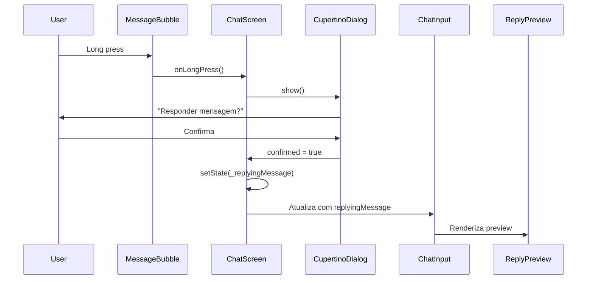
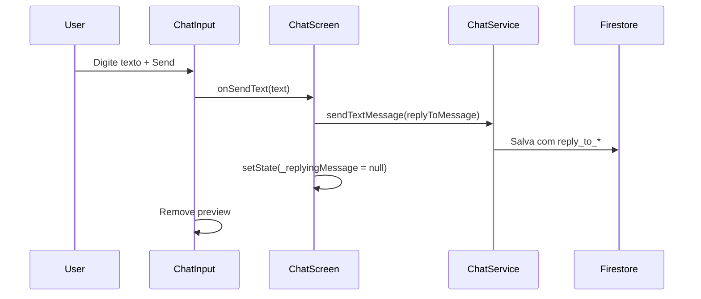
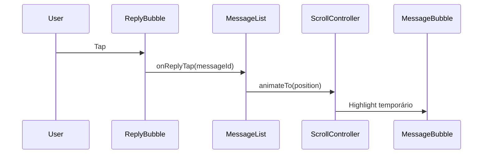

# 📱 Plano de Implementação: Funcionalidade de Responder Mensagens (WhatsApp Style)

## 📋 Review do Código Atual

### ✅ Pontos Positivos
1. **Arquitetura bem estruturada**: Separação clara entre UI (widgets), lógica (services) e modelos
2. **Singleton pattern**: `ChatService` usa singleton corretamente evitando múltiplas instâncias
3. **Performance otimizada**: Cache de mensagens, StreamSubscriptionMixin para gerenciar subscriptions
4. **Suporte a múltiplos contextos**: Código já diferencia chat 1x1 e chat de eventos (`isEvent`, `eventId`)
5. **Widget reutilizável pronto**: `GlimpseCupertinoDialog` já implementado e pronto para uso

### ⚠️ Pontos de Atenção
1. **Model de mensagem limitado**: Falta campos para reply (referência à mensagem original)
2. **UI não preparada**: `GlimpseChatBubble` e `GlimpseChatInput` não suportam preview de reply
3. **Firestore schema**: Precisa acomodar dados de reply nas subcoleções de mensagens

### 🔍 Refinamentos Técnicos Importantes

#### 1. Dialog de Confirmação vs Menu Contextual
**Implementação Atual**: Dialog de confirmação no long press  
**Consideração**: WhatsApp/Telegram usam menu contextual sem confirmação extra

**Estratégia**:
- ✅ Manter dialog inicial (mais seguro para MVP)
- 🔄 Código preparado para evoluir para:
  - `BottomSheet` com múltiplas ações (Responder, Copiar, Deletar, etc.)
  - `ContextMenuAction` (iOS 13+)
  - `Swipe to reply` (gesto lateral)

**Benefício**: Arquitetura já permite essa troca sem refactor profundo

#### 2. Scroll para Mensagem Original (Performance)
**⚠️ Evitar**: `GlobalKey` por mensagem (overhead alto em listas grandes)

**Abordagens Recomendadas**:
1. **Map de índices**: `Map<messageId, index>` (atualizado dinamicamente)
2. **ScrollablePositionedList**: Package que permite scroll por item ID
3. **Cálculo de offset**: Para listas não invertidas

**Desafios a considerar**:
- Chats com milhares de mensagens
- Paginação lazy (mensagens antigas não carregadas)
- Mensagem original fora do viewport atual
- Performance em listas invertidas (reverse: true)

**Solução Proposta**:
```dart
// Usar package scrollable_positioned_list
final ItemScrollController itemScrollController = ItemScrollController();

// Scroll suave para mensagem
void _scrollToMessage(String messageId) {
  final index = _messageIndexMap[messageId];
  if (index != null) {
    itemScrollController.scrollTo(
      index: index,
      duration: Duration(milliseconds: 300),
      curve: Curves.easeInOut,
    );
    // Trigger highlight animation
    _highlightMessage(messageId);
  } else {
    // Mensagem não carregada, buscar do Firestore
    _loadMessageAndScroll(messageId);
  }
}
```

#### 3. Validação de Tamanho de Texto
**Regra**: `reply_to_text` limitado a 100 caracteres

**Implementação**:
- ✅ Validação no **backend** (não só UI)
- ✅ Truncar antes de salvar no Firestore
- ✅ Economiza payload, storage e previne abuso

```dart
// No ChatService antes de salvar
String sanitizeReplyText(String? text) {
  if (text == null || text.isEmpty) return '';
  final cleaned = text.trim();
  return cleaned.length > 100 
    ? '${cleaned.substring(0, 97)}...' 
    : cleaned;
}
```

---

## 🎯 Objetivo

Implementar funcionalidade de responder mensagens similar ao WhatsApp:
- Long press na mensagem para abrir dialog de confirmação
- Preview da mensagem sendo respondida no input
- Visual de reply na bolha de mensagem
- Navegação para mensagem original ao clicar no reply
- Funciona em chat 1x1 e chat de grupo (eventos)

---

## 📐 Arquitetura da Solução

```
┌─────────────────────────────────────────────────────────────┐
│                    ChatScreenRefactored                      │
│  ┌──────────────────────────────────────────────────────┐  │
│  │              MessageListWidget                        │  │
│  │  ┌────────────────────────────────────────────────┐  │  │
│  │  │      GlimpseChatBubble (long press)            │  │  │
│  │  │              ↓                                  │  │  │
│  │  │    GlimpseCupertinoDialog.show()               │  │  │
│  │  │              ↓                                  │  │  │
│  │  │    setState → _replyingMessage = message       │  │  │
│  │  └────────────────────────────────────────────────┘  │  │
│  └──────────────────────────────────────────────────────┘  │
│                          ↓                                  │
│  ┌──────────────────────────────────────────────────────┐  │
│  │          GlimpseChatInput                            │  │
│  │  - ReplyPreviewWidget (se _replyingMessage != null) │  │
│  │  - TextField                                         │  │
│  │  - SendButton → sendMessage(reply: _replyingMessage)│  │
│  └──────────────────────────────────────────────────────┘  │
└─────────────────────────────────────────────────────────────┘
                            ↓
                    ChatService.sendTextMessage()
                            ↓
                    Firestore com reply data
```

---

## 🗂️ Estrutura de Dados

### 1. Objeto `ReplySnapshot` (novo - melhor organização)

**Localização**: `lib/screens/chat/models/reply_snapshot.dart`

```dart
/// Snapshot imutável de uma mensagem sendo respondida
/// Evita espalhar múltiplos campos e facilita evolução futura
class ReplySnapshot {
  const ReplySnapshot({
    required this.messageId,
    required this.senderId,
    required this.senderName,
    this.text,
    this.imageUrl,
    this.type = 'text',
  });

  final String messageId;
  final String senderId;
  final String senderName;
  final String? text;          // Máximo 100 chars (validado no backend)
  final String? imageUrl;      // URL da imagem original
  final String type;           // 'text', 'image', 'audio' (futuro)

  /// Criar a partir de Message
  factory ReplySnapshot.fromMessage(Message message, String senderName) {
    return ReplySnapshot(
      messageId: message.id,
      senderId: message.senderId ?? message.userId,
      senderName: senderName,
      text: _truncateText(message.text),
      imageUrl: message.imageUrl,
      type: message.type,
    );
  }

  /// Truncar texto para 100 chars
  static String? _truncateText(String? text) {
    if (text == null || text.isEmpty) return null;
    final cleaned = text.trim();
    return cleaned.length > 100 
      ? '${cleaned.substring(0, 97)}...' 
      : cleaned;
  }

  /// Converter para Map (salvar no Firestore)
  Map<String, dynamic> toMap() {
    return {
      'reply_to_message_id': messageId,
      'reply_to_sender_id': senderId,
      'reply_to_sender_name': senderName,
      if (text != null) 'reply_to_text': text,
      if (imageUrl != null) 'reply_to_image_url': imageUrl,
      'reply_to_type': type,
    };
  }

  /// Criar a partir de Map (ler do Firestore)
  factory ReplySnapshot.fromMap(Map<String, dynamic> map) {
    return ReplySnapshot(
      messageId: map['reply_to_message_id'] as String,
      senderId: map['reply_to_sender_id'] as String,
      senderName: map['reply_to_sender_name'] as String,
      text: map['reply_to_text'] as String?,
      imageUrl: map['reply_to_image_url'] as String?,
      type: map['reply_to_type'] as String? ?? 'text',
    );
  }

  @override
  bool operator ==(Object other) =>
      identical(this, other) ||
      other is ReplySnapshot &&
          runtimeType == other.runtimeType &&
          messageId == other.messageId;

  @override
  int get hashCode => messageId.hashCode;
}
```

**Benefícios**:
- ✅ Reduz parâmetros em widgets (5 campos → 1 objeto)
- ✅ Facilita adicionar tipos futuros (áudio, vídeo, link)
- ✅ Imutável e type-safe
- ✅ Validação centralizada (truncate)

---

### 2. Modelo `Message` (atualizado - simplificado)

```dart
class Message {
  final String id;
  final String? text;
  final String? imageUrl;
  final String userId;
  final String? senderId;
  final String? receiverId;
  final String type;
  final DateTime? timestamp;
  final bool? isRead;
  final Map<String, dynamic>? params;
  
  // 🆕 Campo único para reply (em vez de 5 campos separados)
  final ReplySnapshot? replyTo;
  
  // ... construtores e métodos
}
```

**Nota**: Internamente no Firestore ainda são campos separados (`reply_to_message_id`, `reply_to_text`, etc.),
mas no código Dart usamos o objeto `ReplySnapshot` para melhor organização.

### 2. Estrutura no Firestore

```javascript
Connections/{userId}/Conversations/{otherUserId}/Messages/{messageId}
{
  "message": "Sim, vou chegar às 20h!",
  "message_text": "Sim, vou chegar às 20h!",
  "sender_id": "user123",
  "user_id": "user123",
  "receiver_id": "user456",
  "message_type": "text",
  "timestamp": Timestamp,
  "message_read": true,
  
  // 🆕 Dados de reply (max 100 chars no texto, validado no backend)
  "reply_to_message_id": "msg789",
  "reply_to_text": "Que horas você vai chegar?",  // Truncado se > 100 chars
  "reply_to_sender_id": "user456",
  "reply_to_sender_name": "João Silva",
  "reply_to_image_url": null,  // opcional
  "reply_to_type": "text"      // 'text', 'image', 'audio' (futuro)
}
```

**Regras de Validação Backend**:
- `reply_to_text`: máximo 100 caracteres (truncado com "..." se maior)
- `reply_to_sender_name`: obrigatório se `reply_to_message_id` existe
- `reply_to_type`: default 'text' se não especificado

---

## 📦 Componentes a Criar/Modificar

### 0️⃣ **ReplySnapshot** (novo arquivo - classe modelo)
**Localização**: `lib/screens/chat/models/reply_snapshot.dart`

```dart
/// Snapshot imutável de dados de reply
/// Reduz parâmetros e facilita evolução futura
class ReplySnapshot {
  final String messageId;
  final String senderId;
  final String senderName;
  final String? text;       // Max 100 chars
  final String? imageUrl;
  final String type;        // 'text', 'image', 'audio'
  
  // Factory, toMap, fromMap, etc. (ver seção anterior)
}
```

**Responsabilidades**:
- Encapsular dados de reply
- Validação e truncamento de texto
- Serialização para Firestore
- Type-safe e imutável

---

### 1️⃣ **ReplyPreviewWidget** (novo arquivo)
**Localização**: `lib/screens/chat/widgets/reply_preview_widget.dart`

```dart
/// Widget que mostra preview da mensagem sendo respondida
/// Aparece acima do input de texto
class ReplyPreviewWidget extends StatelessWidget {
  final ReplySnapshot replySnapshot; // 🆕 Uso do objeto
  final VoidCallback onCancel;
  final bool isOwnMessage; // Para cor da barra
  
  // Mostra:
  // - Linha vertical colorida (azul para próprio, cinza para outros)
  // - Nome do autor (sempre, para contexto)
  // - Preview do texto/imagem (já truncado)
  // - Botão X para cancelar
  // - Ícone de tipo (texto, foto, áudio)
}
```

**Responsabilidades**:
- Exibir preview compacto (1-2 linhas)
- Diferenciar mensagens próprias visualmente
- Permitir cancelar o reply (botão X)
- Mostrar ícone do tipo de mensagem
- Animação suave ao aparecer/desaparecer

---

### 2️⃣ **ReplyBubbleWidget** (novo arquivo)
**Localização**: `lib/screens/chat/widgets/reply_bubble_widget.dart`

```dart
/// Widget que renderiza a referência de reply dentro de uma bolha de mensagem
/// Aparece acima do texto principal da mensagem
class ReplyBubbleWidget extends StatelessWidget {
  final ReplySnapshot replySnapshot; // 🆕 Uso do objeto
  final bool isUserSender;
  final VoidCallback? onTap; // Scroll para mensagem original
  
  // Mostra:
  // - Borda esquerda colorida (3px)
  // - Nome do autor (sempre para contexto)
  // - Texto ou indicador de tipo (📷 Foto, 🎤 Áudio)
  // - Thumbnail de imagem 40x40 (se houver)
  // - Ripple effect ao tocar
}
```

**Responsabilidades**:
- Renderizar reply compacto (altura fixa ~60px)
- Permitir clicar para navegar até original
- Mostrar thumbnail otimizado de imagem
- Adaptar cores ao tema e tipo de mensagem
- Indicar tipo visualmente (ícones)

---

### 3️⃣ **Modificação: `Message` Model**
**Arquivo**: `lib/screens/chat/models/message.dart`

**Mudanças**:
```dart
// Adicionar campo de reply ao construtor (simplificado)
const Message({
  // ... campos existentes
  this.replyTo, // 🆕 Objeto único em vez de 5 campos
});

final ReplySnapshot? replyTo; // 🆕

// Atualizar fromDocument para ler reply data
static Message? fromDocument(Map<String, dynamic> data, String id) {
  // ... código existente
  
  // 🆕 Criar ReplySnapshot se campos existirem
  ReplySnapshot? replyTo;
  if (data['reply_to_message_id'] != null) {
    try {
      replyTo = ReplySnapshot.fromMap(data);
    } catch (e) {
      debugPrint('⚠️ Erro ao parsear reply: $e');
    }
  }
  
  return Message(
    // ... campos existentes
    replyTo: replyTo, // 🆕
  );
}

// Atualizar toMap para salvar reply data
Map<String, dynamic> toMap() {
  return {
    // ... campos existentes
    if (replyTo != null) ...replyTo!.toMap(), // 🆕 Spread operator
  };
}

// Atualizar copyWith (simplificado)
Message copyWith({
  // ... parâmetros existentes
  ReplySnapshot? replyTo, // 🆕 Um campo apenas
}) {
  return Message(
    // ... campos existentes
    replyTo: replyTo ?? this.replyTo,
  );
}
```

---

### 4️⃣ **Modificação: `GlimpseChatBubble`**
**Arquivo**: `lib/screens/chat/widgets/glimpse_chat_bubble.dart`

**Mudanças**:
```dart
class GlimpseChatBubble extends StatelessWidget {
  const GlimpseChatBubble({
    // ... parâmetros existentes
    this.replyTo,      // 🆕 Objeto único
    this.onReplyTap,
    this.onLongPress,  // 🆕 Callback para long press
  });
  
  // ... campos existentes
  final ReplySnapshot? replyTo;    // 🆕 Simplificado
  final VoidCallback? onReplyTap;
  final VoidCallback? onLongPress; // 🆕
  
  @override
  Widget build(BuildContext context) {
    // ... código existente
    
    return GestureDetector(
      onLongPress: onLongPress, // 🆕
      onTap: (imageUrl != null) ? _showImageLightbox : null,
      child: Container(
        // ...
        child: Column(
          crossAxisAlignment: isUserSender 
            ? CrossAxisAlignment.end 
            : CrossAxisAlignment.start,
          children: [
            // 🆕 Mostrar reply se existir
            if (replyTo != null)
              Padding(
                padding: const EdgeInsets.only(bottom: 8),
                child: ReplyBubbleWidget(
                  replySnapshot: replyTo!,
                  isUserSender: isUserSender,
                  onTap: onReplyTap,
                ),
              ),
            // Conteúdo original da mensagem
            // ...
          ],
        ),
      ),
    );
  }
}
```

**Benefício**: Menos parâmetros (5 campos → 1 objeto)

---

### 5️⃣ **Modificação: `GlimpseChatInput`**
**Arquivo**: `lib/screens/chat/components/glimpse_chat_input.dart`

**Mudanças**:
```dart
class GlimpseChatInput extends StatefulWidget {
  const GlimpseChatInput({
    // ... parâmetros existentes
    this.replySnapshot,   // 🆕 Objeto simplificado
    this.onCancelReply,   // 🆕
  });
  
  // ... campos existentes
  final ReplySnapshot? replySnapshot; // 🆕 Um objeto apenas
  final VoidCallback? onCancelReply;  // 🆕
  
  @override
  Widget build(BuildContext context) {
    // ... código existente
    
    return Column(
      mainAxisSize: MainAxisSize.min,
      children: [
        // 🆕 Preview de reply com animação
        AnimatedSize(
          duration: const Duration(milliseconds: 200),
          curve: Curves.easeInOut,
          child: widget.replySnapshot != null
            ? ReplyPreviewWidget(
                replySnapshot: widget.replySnapshot!,
                onCancel: widget.onCancelReply ?? () {},
                isOwnMessage: widget.replySnapshot!.senderId == currentUserId,
              )
            : const SizedBox.shrink(),
        ),
        
        // Input original
        Container(
          // ... código existente
        ),
      ],
    );
  }
}
```

**Benefício**: Animação suave + código mais limpo

---

### 6️⃣ **Modificação: `ChatScreenRefactored`**
**Arquivo**: `lib/screens/chat/chat_screen_refactored.dart`

**Mudanças**:
```dart
class ChatScreenRefactoredState extends State<ChatScreenRefactored> {
  // ... variáveis existentes
  ReplySnapshot? _replySnapshot; // 🆕 Objeto simplificado
  
  // 🆕 Método para iniciar reply
  void _handleReplyMessage(Message message) async {
    final i18n = AppLocalizations.of(context);
    
    // Mostrar dialog de confirmação (pode evoluir para BottomSheet)
    final confirmed = await GlimpseCupertinoDialog.show(
      context: context,
      title: i18n.translate('reply_message'),
      message: i18n.translate('do_you_want_to_reply_to_this_message'),
      confirmText: i18n.translate('reply'),
      cancelText: i18n.translate('cancel'),
    );
    
    if (confirmed == true && mounted) {
      // Criar snapshot com nome do sender
      final senderName = message.senderId == AppState.currentUserId
          ? i18n.translate('you')
          : (message.fullName ?? 'Usuário');
      
      setState(() {
        _replySnapshot = ReplySnapshot.fromMessage(message, senderName);
      });
      
      // Focar no input
      FocusScope.of(context).requestFocus(_textFocusNode);
      
      // 🎵 Opcional: Haptic feedback
      HapticFeedback.mediumImpact();
    }
  }
  
  // 🆕 Método para cancelar reply
  void _handleCancelReply() {
    setState(() {
      _replySnapshot = null;
    });
  }
  
  // 🆕 Método para scroll até mensagem original
  void _handleScrollToMessage(String messageId) {
    // Ver implementação detalhada na próxima seção
    _messageListKey.currentState?.scrollToMessage(
      messageId,
      highlight: true,
    );
  }
  
  // Modificar método de envio
  Future<void> _sendTextMessage(String inputText) async {
    await _chatService.sendTextMessage(
      context: context,
      text: inputText,
      receiver: widget.user,
      i18n: _i18n,
      setIsSending: (isSending) => setState(() {}),
      replySnapshot: _replySnapshot, // 🆕 Passar snapshot
    );
    
    // Limpar reply após enviar
    if (_replySnapshot != null) {
      setState(() {
        _replySnapshot = null;
      });
    }
  }
  
  @override
  Widget build(BuildContext context) {
    // ...
    return Scaffold(
      // ...
      body: Column(
        children: [
          // ... widgets existentes
          
          Expanded(
            child: MessageListWidget(
              key: _messageListKey, // 🆕 Para controlar scroll
              // ... props existentes
              onMessageLongPress: _handleReplyMessage, // 🆕
              onReplyTap: _handleScrollToMessage,      // 🆕
            ),
          ),
          
          GlimpseChatInput(
            // ... props existentes
            replySnapshot: _replySnapshot,     // 🆕
            onCancelReply: _handleCancelReply, // 🆕
          ),
        ],
      ),
    );
  }
}
```

**Nota**: `HapticFeedback` opcional para melhor UX no long press

---

### 7️⃣ **Modificação: `MessageListWidget`**
**Arquivo**: `lib/screens/chat/widgets/message_list_widget.dart`

**Mudanças**:
```dart
class MessageListWidget extends StatefulWidget {
  const MessageListWidget({
    super.key,
    // ... parâmetros existentes
    this.onMessageLongPress, // 🆕
    this.onReplyTap,         // 🆕
  });
  
  // ... campos existentes
  final Function(Message)? onMessageLongPress;      // 🆕
  final Function(String messageId)? onReplyTap;     // 🆕
}

class _MessageListWidgetState extends State<MessageListWidget> {
  // ... estado existente
  
  // 🆕 Map para rastrear índices (scroll eficiente)
  final Map<String, int> _messageIndexMap = {};
  
  // 🆕 Mensagem destacada (highlight temporário)
  String? _highlightedMessageId;
  Timer? _highlightTimer;
  
  @override
  void dispose() {
    _highlightTimer?.cancel();
    super.dispose();
  }
  
  // 🆕 Método público para scroll (chamado via GlobalKey)
  void scrollToMessage(String messageId, {bool highlight = false}) {
    final index = _messageIndexMap[messageId];
    
    if (index != null) {
      // Scroll suave
      widget.messagesController.animateTo(
        index * 100.0, // Estimativa de altura por item
        duration: const Duration(milliseconds: 300),
        curve: Curves.easeInOut,
      );
      
      // Highlight temporário
      if (highlight) {
        setState(() => _highlightedMessageId = messageId);
        _highlightTimer?.cancel();
        _highlightTimer = Timer(const Duration(seconds: 2), () {
          if (mounted) {
            setState(() => _highlightedMessageId = null);
          }
        });
      }
    } else {
      debugPrint('⚠️ Mensagem $messageId não encontrada na lista');
      // TODO: Buscar mensagem do Firestore se não estiver carregada
    }
  }
  
  @override
  Widget build(BuildContext context) {
    // ... código existente no ListView.builder
    
    return ListView.builder(
      // ...
      itemBuilder: (context, index) {
        final message = _messages![index];
        
        // 🆕 Atualizar map de índices
        _messageIndexMap[message.id] = index;
        
        // 🆕 Verificar se está highlighted
        final isHighlighted = _highlightedMessageId == message.id;
        
        return AnimatedContainer(
          duration: const Duration(milliseconds: 300),
          decoration: isHighlighted
            ? BoxDecoration(
                color: Theme.of(context).primaryColor.withOpacity(0.1),
                borderRadius: BorderRadius.circular(12),
              )
            : null,
          child: GlimpseChatBubble(
            // ... props existentes
            replyTo: message.replyTo,                        // 🆕
            onLongPress: () => widget.onMessageLongPress?.call(message), // 🆕
            onReplyTap: message.replyTo != null
                ? () => widget.onReplyTap?.call(message.replyTo!.messageId)
                : null, // 🆕
          ),
        );
      },
    );
  }
}
```

**Melhorias**:
- ✅ Map de índices (evita GlobalKey por item)
- ✅ Highlight animado temporário (2 segundos)
- ✅ Fallback para mensagens não carregadas

---

### 8️⃣ **Modificação: `ChatService`**
**Arquivo**: `lib/screens/chat/services/chat_service.dart`

**Mudanças**:
```dart
// Atualizar método sendTextMessage
Future<void> sendTextMessage({
  required BuildContext context,
  required String text,
  required User receiver,
  required AppLocalizations i18n,
  required Function(bool) setIsSending,
  ReplySnapshot? replySnapshot, // 🆕 Objeto simplificado
}) async {
  // ... validações existentes
  
  final messageData = {
    'message': text,
    'message_text': text,
    'sender_id': currentUserId,
    'user_id': currentUserId,
    'receiver_id': receiver.userId,
    'message_type': 'text',
    'timestamp': FieldValue.serverTimestamp(),
    'message_read': false,
    
    // 🆕 Adicionar dados de reply (já validados no ReplySnapshot)
    if (replySnapshot != null) ...replySnapshot.toMap(),
  };
  
  // Salvar no Firestore
  // ... código existente
}

// Atualizar método sendImageMessage
Future<void> sendImageMessage({
  required BuildContext context,
  required File imageFile,
  required User receiver,
  required AppLocalizations i18n,
  required ProgressDialog progressDialog,
  required Function(bool) setIsSending,
  ReplySnapshot? replySnapshot, // 🆕
}) async {
  // ... código de upload existente
  
  final messageData = {
    'message_img_link': downloadUrl,
    'sender_id': currentUserId,
    'user_id': currentUserId,
    'receiver_id': receiver.userId,
    'message_type': 'image',
    'timestamp': FieldValue.serverTimestamp(),
    'message_read': false,
    
    // 🆕 Adicionar dados de reply
    if (replySnapshot != null) ...replySnapshot.toMap(),
  };
  
  // ... código existente
}
```

**Benefícios**:
- ✅ Código mais limpo (spread operator)
- ✅ Validação já feita no `ReplySnapshot`
- ✅ Truncamento automático de texto

---

## 🎨 Design Visual

### Preview de Reply no Input
```
┌─────────────────────────────────────────────┐
│ │ Respondendo a João Silva                  │
│ │ Que horas você vai chegar?           [X]  │
├─────────────────────────────────────────────┤
│ [📎] Digite uma mensagem...          [🔵]  │
└─────────────────────────────────────────────┘
```

### Reply na Bolha de Mensagem
```
┌─────────────────────────────────────────────┐
│ │ João Silva                                │
│ │ Que horas você vai chegar?                │
│                                              │
│ Sim, vou chegar às 20h!                     │
│                                    20:15 ✓✓ │
└─────────────────────────────────────────────┘
```

---

## 🔄 Fluxo de Interação

### 1. Iniciar Reply


### 2. Enviar Reply


### 3. Navegar para Mensagem Original


---

## 🧪 Casos de Teste

### Teste 1: Reply em Chat 1x1
1. Abrir conversa 1x1
2. Long press em mensagem recebida
3. Confirmar dialog
4. Verificar preview no input
5. Digitar texto e enviar
6. Verificar mensagem salva com reply
7. Clicar no reply na bolha
8. Verificar scroll para mensagem original

### Teste 2: Reply em Chat de Grupo (Evento)
1. Abrir chat de evento
2. Long press em mensagem de outro usuário
3. Confirmar dialog
4. Verificar nome do autor no preview
5. Enviar mensagem
6. Verificar nome do autor no reply bubble

### Teste 3: Cancelar Reply
1. Iniciar reply
2. Clicar no X no preview
3. Verificar preview removido
4. Enviar mensagem
5. Verificar mensagem sem reply

### Teste 4: Reply de Imagem
1. Long press em mensagem com imagem
2. Confirmar reply
3. Verificar thumbnail no preview
4. Enviar resposta
5. Verificar indicador de imagem no reply bubble

### Teste 5: Mensagem Original Deletada
1. Criar reply para mensagem
2. Deletar mensagem original
3. Verificar reply ainda visível (com cache)
4. Clicar no reply
5. Tratar caso de mensagem não encontrada

---

## 📝 Traduções Necessárias (i18n)

Adicionar ao arquivo de traduções:

```json
{
  "reply_message": "Responder mensagem",
  "do_you_want_to_reply_to_this_message": "Deseja responder esta mensagem?",
  "reply": "Responder",
  "replying_to": "Respondendo a",
  "you": "Você",
  "photo": "Foto",
  "message_not_found": "Mensagem original não encontrada"
}
```

---

## 🚀 Plano de Implementação (Ordem)

### Fase 1: Estrutura Base (2-3 horas)
1. ✅ Criar classe `ReplySnapshot` (`lib/screens/chat/models/reply_snapshot.dart`)
2. ✅ Atualizar `Message` model com campo `replyTo`
3. ✅ Criar `ReplyPreviewWidget` com animação
4. ✅ Criar `ReplyBubbleWidget` com ripple effect
5. ✅ Adicionar traduções (i18n)

**Checklist Fase 1**:
- [ ] ReplySnapshot com validação de 100 chars
- [ ] Message.fromDocument parseando reply
- [ ] Message.toMap com spread do ReplySnapshot
- [ ] ReplyPreviewWidget com ícones de tipo
- [ ] ReplyBubbleWidget com thumbnail

### Fase 2: Integração UI (2-3 horas)
6. ✅ Modificar `GlimpseChatBubble` (adicionar reply bubble e long press)
7. ✅ Modificar `GlimpseChatInput` (adicionar preview com AnimatedSize)
8. ✅ Modificar `MessageListWidget` (Map de índices + highlight)
9. ✅ Modificar `ChatScreenRefactored` (gerenciar estado + callbacks)

**Checklist Fase 2**:
- [ ] Long press funcionando (com HapticFeedback)
- [ ] Dialog de confirmação (preparado para BottomSheet futuro)
- [ ] Preview aparecendo/sumindo com animação
- [ ] Estado limpo após enviar mensagem

### Fase 3: Backend (1-2 horas)
10. ✅ Atualizar `ChatService.sendTextMessage()` com ReplySnapshot
11. ✅ Atualizar `ChatService.sendImageMessage()` com ReplySnapshot
12. ✅ Adicionar validação de tamanho no backend (truncate)
13. ✅ Testar salvamento e leitura do Firestore

**Checklist Fase 3**:
- [ ] Mensagens salvando com reply_to_* corretamente
- [ ] Texto truncado a 100 chars no backend
- [ ] Leitura parseando ReplySnapshot
- [ ] Imagens com reply funcionando

### Fase 4: Navegação e Highlight (2-3 horas)
14. ✅ Implementar scroll com Map de índices (evitar GlobalKey)
15. ✅ Adicionar highlight temporário animado (glow/pulse)
16. ✅ Tratar mensagem não encontrada (buscar do Firestore)
17. ✅ Testar em listas grandes e com paginação

**Checklist Fase 4**:
- [ ] Scroll suave para mensagem original
- [ ] Highlight com AnimatedContainer (2s)
- [ ] Fallback para mensagens não carregadas
- [ ] Performance OK em listas grandes

### Fase 5: Testes e Refinamentos (2-3 horas)
18. ✅ Testar em chat 1x1 (sender name correto)
19. ✅ Testar em chat de evento (nome do autor visível)
20. ✅ Testar casos extremos (imagem, mensagem deletada, offline)
21. ✅ Ajustes de UX (cores, espaçamentos, animações)
22. ✅ Code review e documentação

**Checklist Fase 5**:
- [ ] Todos os casos de teste passando
- [ ] UI consistente dark/light mode
- [ ] Sem memory leaks ou crashes
- [ ] Código documentado

**Tempo total estimado: 9-14 horas** (ajustado com melhorias)

---

## 🔒 Segurança e Performance

### Segurança
- ✅ Validar que usuário tem acesso à conversa antes de salvar reply
- ✅ Não expor dados sensíveis no cache de reply
- ✅ Verificar permissões no chat de grupo

### Performance
- ✅ Cachear dados de reply (texto, nome do autor) para evitar queries extras
- ✅ Limitar tamanho do texto no preview (max 100 chars)
- ✅ Usar thumbnail pequeno para imagens (já existente no imageUrl)
- ✅ Lazy load de nome do autor apenas se não estiver em cache

---

## 📚 Referências

- Código base: `chat_screen_refactored.dart`
- Dialog: `cupertino_dialog.dart`
- Modelo: `message.dart`
- Widgets: `glimpse_chat_bubble.dart`, `glimpse_chat_input.dart`
- Service: `chat_service.dart`

---

## ✨ Melhorias Futuras (Opcionais)

### 🎯 Prioridade Alta (UX Premium)
1. **Animação ao mostrar/esconder preview** 
   - ✅ FadeIn/FadeOut com AnimatedSize
   - ✅ Slide up/down suave
   - Duração: 200-300ms

2. **Vibração ao long press** 
   - ✅ HapticFeedback.mediumImpact()
   - Melhora percepção tátil

3. **Highlight com efeito visual rico**
   - ✅ Pulse/glow animation
   - ✅ Background temporário (2s)
   - Inspiração: WhatsApp highlight

4. **BottomSheet contextual (em vez de dialog)**
   - Múltiplas ações: Responder, Copiar, Deletar, Encaminhar
   - Estilo nativo iOS/Android
   - Mais rápido que dialog

### 🔄 Prioridade Média (Gestos)
5. **Swipe para reply** 
   - Alternativa ao long press (mais rápido)
   - Gesto lateral → preview aparece
   - Popular em apps modernos

6. **Context Menu (iOS 13+)**
   - Menu nativo do iOS com preview
   - Ações contextuais ricas
   - Melhor integração com sistema

### 📊 Prioridade Baixa (Features Avançadas)
7. **Reply de múltiplas mensagens** 
   - Thread de respostas
   - Visualização em árvore
   - Complexo de implementar

8. **Estatísticas de reply** 
   - Quantas vezes mensagem foi respondida
   - Badge visual
   - Analytics

9. **Preview de link no reply** 
   - Metadata de URLs (og:image, title)
   - Thumbnail automático
   - Requer scraping

10. **Reply offline** 
    - Queue de replies pendentes
    - Sincronização automática
    - Retry logic

### 🛠️ Melhorias Técnicas (Performance)
11. **ScrollablePositionedList package**
    - Scroll preciso por item ID
    - Performance em listas grandes
    - Substituir Map de índices

12. **Lazy loading de mensagens antigas**
    - Carregar sob demanda ao scroll
    - Cache inteligente
    - Reduz uso de memória

13. **Compressão de ReplySnapshot**
    - Remover dados redundantes
    - Economizar Firestore storage
    - Apenas essencial no cache

---

**Documento criado em**: 19 de dezembro de 2025  
**Última atualização**: 19 de dezembro de 2025  
**Status**: 📋 Planejamento Completo (Versão Premium)

---

## 📚 Apêndice: Pacotes Úteis

### Recomendados
```yaml
dependencies:
  # Scroll preciso para mensagens
  scrollable_positioned_list: ^0.3.8
  
  # Haptic feedback multiplataforma
  flutter/services.dart # Nativo
  
  # Animações suaves
  flutter/animation.dart # Nativo
```

### Opcionais (Features Avançadas)
```yaml
dependencies:
  # Link preview
  link_preview_generator: ^3.0.2
  
  # Image cache otimizado
  cached_network_image: ^3.3.1
  
  # Bottom sheet customizado
  modal_bottom_sheet: ^3.0.0
```

---

## 🎓 Lições Aprendidas (Best Practices)

### ✅ O que fazer
1. **Usar objetos imutáveis** (`ReplySnapshot`) em vez de múltiplos campos
2. **Validar no backend** (truncate de texto) antes de salvar
3. **Evitar GlobalKey por item** - usar Map de índices
4. **Cachear dados de reply** - economiza queries ao Firestore
5. **Preparar para evolução** - código modular para BottomSheet/Swipe

### ❌ O que evitar
1. **Não usar GlobalKey para cada mensagem** - overhead alto
2. **Não esquecer mensagens não carregadas** - implementar fallback
3. **Não confiar só em UI** - validação sempre no backend
4. **Não ignorar performance** - testar com listas grandes
5. **Não esquecer estados de erro** - mensagem deletada, offline, etc.

---

## 🔗 Recursos e Referências

### Documentação Oficial
- [Flutter Gestures](https://docs.flutter.dev/ui/interactivity/gestures)
- [AnimatedContainer](https://api.flutter.dev/flutter/widgets/AnimatedContainer-class.html)
- [HapticFeedback](https://api.flutter.dev/flutter/services/HapticFeedback-class.html)
- [Firestore Best Practices](https://firebase.google.com/docs/firestore/best-practices)

### Inspirações de Design
- WhatsApp reply system
- Telegram message reply
- iMessage reactions and replies
- Discord quote system

### Código Base do Projeto
- `chat_screen_refactored.dart` - Tela principal
- `cupertino_dialog.dart` - Dialog base
- `message.dart` - Modelo de dados
- `glimpse_chat_bubble.dart` - Bolha de mensagem
- `glimpse_chat_input.dart` - Input de texto
- `chat_service.dart` - Lógica de negócio
